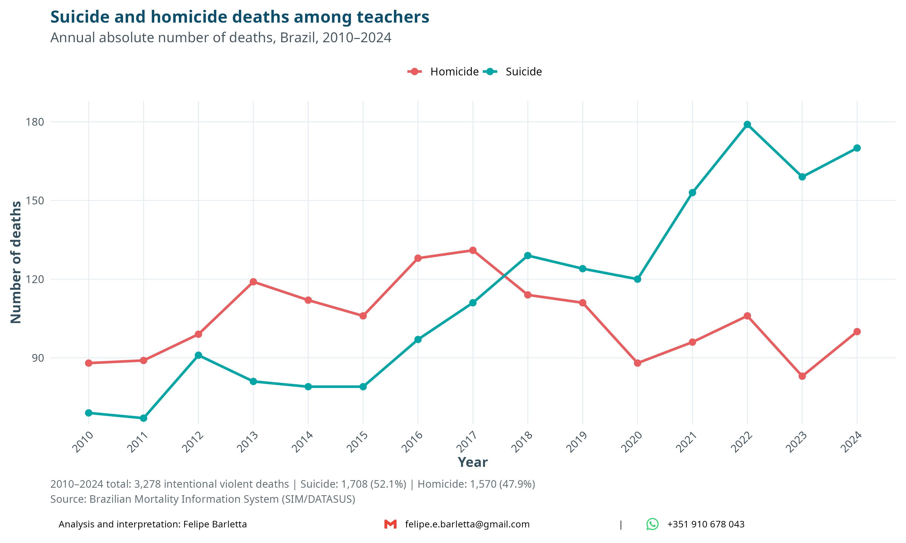
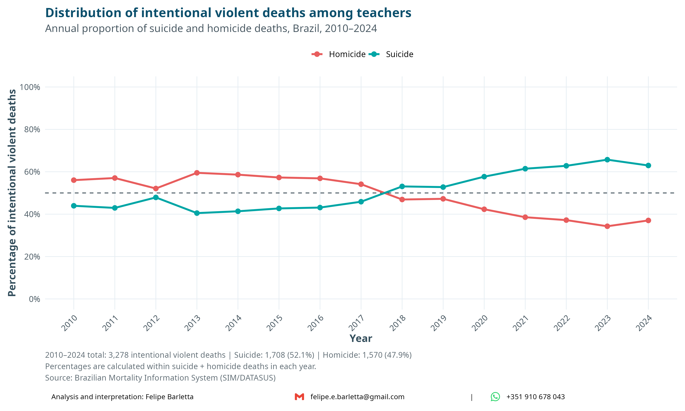

# Mortality among Teachers in Brazil

### A descriptive analysis of SIM/DATASUS data, 2010–2024

This project presents a reproducible statistical analysis of mortality among
teachers in Brazil using microdata from the **Mortality Information System
(SIM)**, made publicly available by **DATASUS / Brazilian Ministry of Health**.

The analysis covers deaths registered between **2010 and 2024** and describes
the demographic profile, underlying causes of death, external causes, and the
temporal patterns of **suicide and homicide among teachers**.

The project was developed in **R**, with emphasis on reproducibility,
transparent data processing, statistical visualization, and communication of
public health data.

---

## About DATASUS and SIM

**DATASUS** is the Department of Information and Informatics of the Brazilian
Unified Health System (SUS) and provides access to several national health
information systems.

Among these systems, the **Mortality Information System (SIM)** contains
individual records derived from Death Certificates registered in Brazil.

SIM provides information such as:

- date of death;
- age;
- sex;
- race/skin color;
- municipality of residence;
- underlying cause of death;
- occupation.

The underlying cause of death is coded according to the **International
Classification of Diseases (ICD-10)**.

This project uses the occupation information recorded in SIM to identify deaths
among teachers.

---

## Objective

The main objective is to describe deaths among teachers recorded in
SIM/DATASUS between **2010 and 2024**, characterize their demographic and
cause-of-death profiles, and investigate the temporal patterns of **suicide and
homicide**.

The analysis focuses on questions such as:

- How many deaths among teachers were recorded during the study period?
- What is the demographic profile of these deaths?
- What are the most frequent underlying causes of death?
- What are the main external causes of death?
- How have suicide and homicide deaths changed over time?
- Has the relative contribution of suicide and homicide changed during
  2010–2024?

---

## Who is included?

Teachers were identified from the occupation recorded in SIM using occupations
whose **Brazilian Classification of Occupations (CBO)** description contained
the term **"Professor"**.

This broad operational definition includes teaching occupations across
different educational levels and fields, including:

- early childhood education;
- primary and secondary education;
- youth and adult education;
- vocational and professional education;
- special education;
- free courses and other teaching activities;
- higher education, including university professors.

> **Important:** the occupation variable available in SIM does not distinguish
> between public-sector and private-sector employment. Therefore, this analysis
> should not be interpreted as referring exclusively to public-school teachers.

The occupation recorded on the Death Certificate represents the individual's
**usual occupation** and may also refer to a previous occupation for retired or
unemployed individuals. Consequently, the records do not necessarily represent
teachers who were actively employed at the time of death.

---

## Data

The analysis includes deaths registered between:

**2010–2024**

After applying the operational definition of teaching occupations, the final
dataset contained:

### 195,477 deaths among teachers

The individual-level processed SIM dataset is **not included in this
repository**.

Instead, the R Markdown workflow contains the code used to download, process,
and reconstruct the analytical dataset from the publicly available DATASUS
source.

Only aggregated results and figures required to reproduce the reported findings
are stored in the repository.

---

## Data processing

SIM microdata were obtained programmatically in R using the
`microdatasus` package.

The general workflow was:

```text
DATASUS / SIM
      │
      ▼
Download annual mortality microdata
      │
      ▼
Process SIM variables
      │
      ▼
Identify teaching occupations using CBO
      │
      ▼
Construct demographic and ICD-10 variables
      │
      ▼
Classify external causes
      │
      ▼
Statistical summaries and visualization
      │
      ▼
Suicide and homicide analysis
```

The processed dataset is cached locally to avoid downloading and processing all
annual SIM files every time the analysis is rendered.

---

## External causes of death

External causes were classified using ICD-10 codes.

The main categories considered include:

| Category | ICD-10 codes |
|---|---|
| Transport accidents | V01–V99 |
| Falls | W00–W19 |
| Drowning | W65–W74 |
| Accidental poisoning | X40–X49 |
| Suicide | X60–X84 |
| Homicide | X85–X99 and Y00–Y09 |
| Undetermined intent | Y10–Y34 |

Other ICD-10 codes within the V, W, X, and Y chapters were grouped as other
external causes when appropriate.

---

# Suicide and Homicide

A specific part of the project investigates **intentional violent deaths**,
defined here as deaths classified as suicide or homicide according to the
underlying ICD-10 cause.

Across 2010–2024, the analysis identified:

| Cause | Deaths | Percentage |
|---|---:|---:|
| Suicide | **1,708** | **52.1%** |
| Homicide | **1,570** | **47.9%** |
| **Total** | **3,278** | **100%** |

These percentages use **suicide + homicide deaths as the denominator** and
should not be interpreted as percentages of all teacher deaths.

---

## Annual number of suicide and homicide deaths

The first figure shows the annual absolute number of deaths classified as
suicide and homicide.



The temporal pattern shows an important change in the relative contribution of
the two causes. Homicide accounted for more deaths during much of the earlier
part of the study period, whereas suicide became increasingly prominent during
the later years.

---

## Annual distribution of intentional violent deaths

The second figure examines the annual percentage distribution between suicide
and homicide.



The dashed horizontal line represents **50%**, corresponding to an equal annual
share of suicide and homicide.

From **2018 onward**, suicide accounted for the larger annual share of these two
intentional violent causes. By the end of the study period, suicide represented
roughly two-thirds of the annual suicide-and-homicide total.

---

## Interpretation

The results indicate a substantial change in the composition of intentional
violent deaths among teachers during the study period.

Across the entire 2010–2024 period, suicide represented a slightly larger share
than homicide:

- **1,708 suicide deaths (52.1%)**
- **1,570 homicide deaths (47.9%)**

However, the annual analysis reveals information that is not visible from the
overall totals alone.

The relative contribution of suicide increased over time, eventually exceeding
that of homicide. This illustrates the importance of examining temporal
patterns rather than relying exclusively on aggregated counts.

These findings are descriptive and should motivate further investigation rather
than be interpreted as evidence of causal relationships.

---

## Important epidemiological considerations

### Counts are not mortality rates

This project analyzes the number and distribution of deaths among individuals
whose occupation was recorded as a teaching occupation in SIM.

The results **do not represent mortality rates among Brazilian teachers**.

Estimating mortality rates would require appropriate population denominators,
such as the number of teachers in Brazil by year, age, sex, and potentially
other characteristics.

Therefore, the analysis cannot determine whether teachers have higher or lower
mortality than other occupational groups.

### Public and private employment

The SIM occupation field identifies occupation but does not identify whether a
teacher worked in the **public or private sector**.

Consequently, the analysis is not restricted to either employment network.

### Active employment

Occupation on the Death Certificate refers to usual occupation and may reflect
a previous occupation for retired or unemployed individuals.

The dataset therefore cannot establish whether each individual was actively
working as a teacher at the time of death.

### Femicide

Female homicide victims can be identified according to sex and homicide ICD-10
codes, but **femicide cannot be directly identified from the underlying
cause-of-death code alone**.

The classification of femicide requires contextual, motivational, or legal
information that is not available from the variables used in this analysis.

### Descriptive analysis

Associations and temporal patterns reported here should not be interpreted as
causal effects.

---

## Repository structure

```text
datasus-teacher-mortality-brazil/
│
├── Teacher_Mortality_DATASUS.Rmd
├── Teacher_Mortality_DATASUS.html
├── Teacher_Mortality_DATASUS_files/
├── style.css
├── README.md
├── .gitignore
│
├── icons/
│
└── results/
    ├── figures/
    │   ├── teacher_deaths_over_time.png
    │   ├── teacher_top_causes.png
    │   ├── teacher_external_causes.png
    │   ├── teacher_suicide_homicide_absolute.png
    │   └── teacher_suicide_homicide_percentage.png
    │
    ├── teacher_deaths_by_year.csv
    ├── teacher_deaths_by_icd10_category.csv
    ├── teacher_deaths_external_causes.csv
    ├── teacher_occupations.csv
    ├── teacher_occupations_identified.csv
    ├── teacher_suicide_homicide_by_year.csv
    └── session_info.txt
```

The `data/` directory is intentionally excluded from version control because it
contains the locally processed individual-level SIM dataset.

---

## Reproducibility

The complete analysis is available in:

**`Teacher_Mortality_DATASUS.Rmd`**

The rendered report is available in:

**`Teacher_Mortality_DATASUS.html`**

The workflow includes:

1. downloading SIM data;
2. processing mortality records;
3. identifying teaching occupations;
4. constructing demographic variables;
5. processing ICD-10 underlying causes;
6. classifying external causes;
7. generating descriptive statistics;
8. analyzing suicide and homicide;
9. producing tables and figures;
10. exporting aggregated results.

The R session information used to generate the analysis is stored in:

```text
results/session_info.txt
```

---

## Software

The analysis was developed in **R**.

Main packages include:

- `microdatasus`
- `dplyr`
- `tidyr`
- `stringr`
- `ggplot2`
- `kableExtra`
- `cowplot`
- `scales`

---

## Data source

**Sistema de Informações sobre Mortalidade (SIM)**
**DATASUS — Ministério da Saúde, Brazil**

The original mortality microdata are publicly available through DATASUS.

---

## Author

**Felipe Barletta**

Statistics · Bayesian Modeling · Data Science · Public Health Data

📧 **felipe.e.barletta@gmail.com**

GitHub: **@felipebarlettaPhD**

---

## Citation and reuse

If you use or adapt the code, figures, or analytical workflow from this
repository, please acknowledge the author and the original SIM/DATASUS data
source.

---

## Disclaimer

This is an independent statistical analysis based on publicly available health
data.

The analyses, interpretations, visualizations, and conclusions presented in
this repository are the responsibility of the author and do not represent an
official analysis by DATASUS or the Brazilian Ministry of Health.